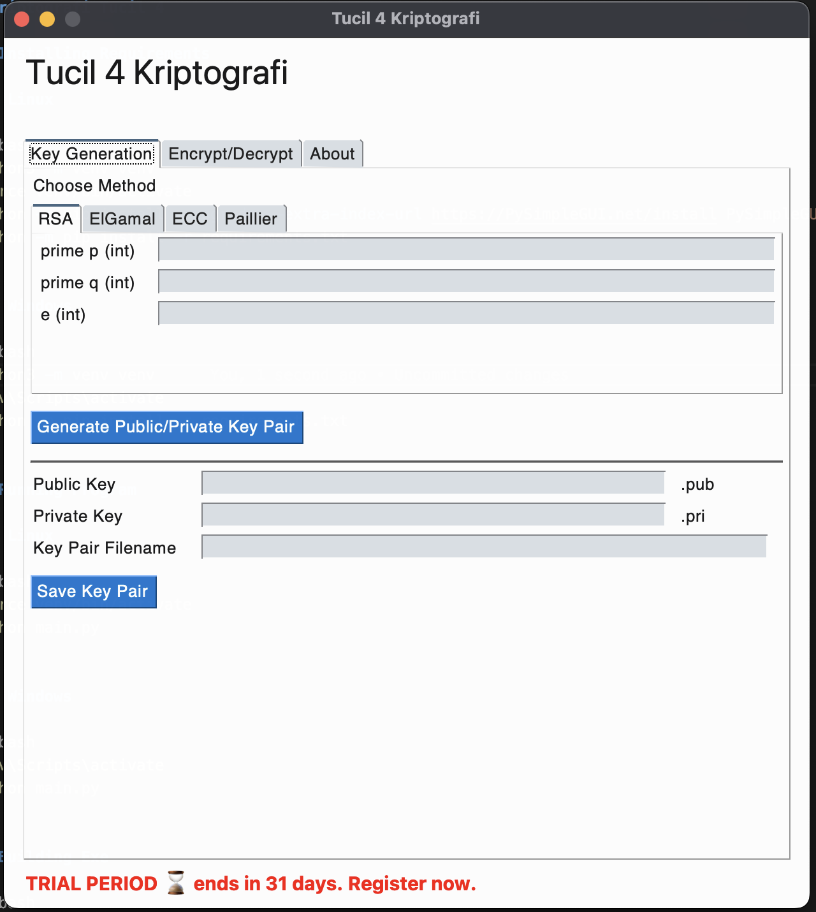
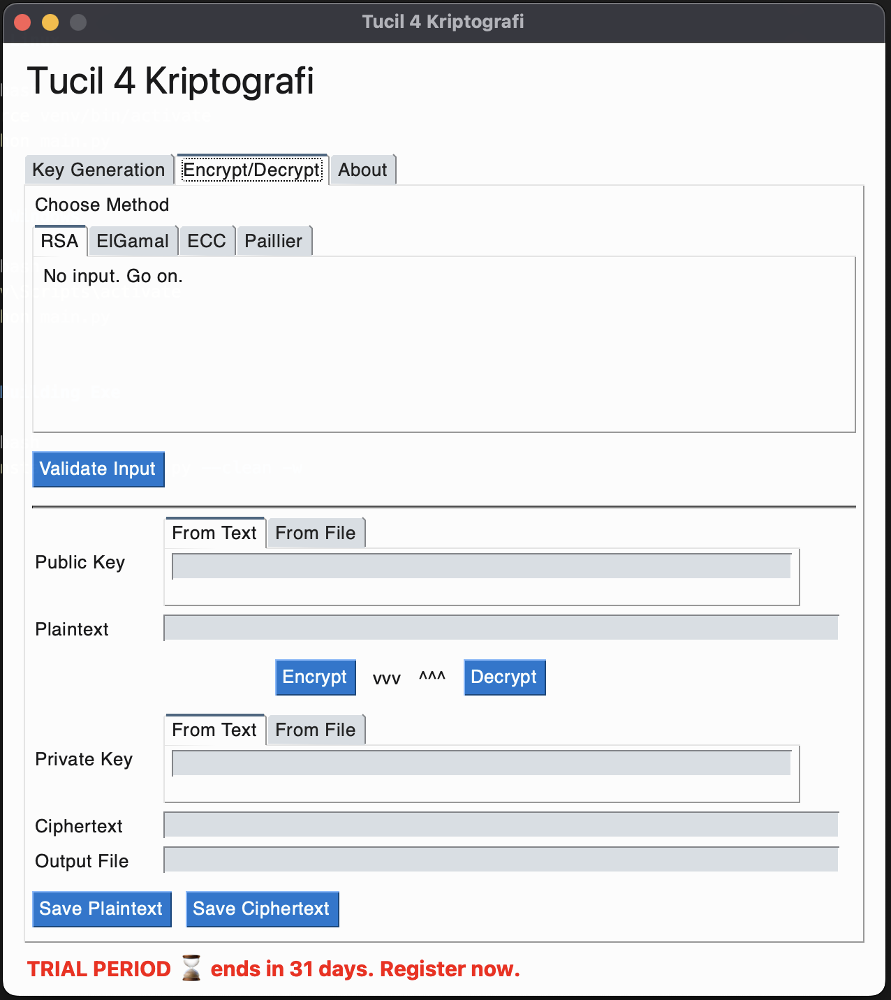

# Kriptografi Tucil 4

## Project Description

This project is a cryptography toolkit for encrypting and decrypting files and plain text using various algorithms, including RSA, ElGamal, Paillier, and ECC. It provides a graphical user interface (GUI) built with PySimpleGUI for easy interaction.

### Features

- Key generation (RSA, ElGamal, Paillier, ECC)
- Encrypt / decrypt plain text
- Encrypt / decrypt files
- Load & save key pairs
- Unified PySimpleGUI interface

<div align="center">
	<a href="docs/key-generation.png"></a>&nbsp;&nbsp;&nbsp;&nbsp;
	<a href="docs/encrypt-decrypt.png"></a>
</div>

## Installing Requirements

### Linux

```bash
python3 -m venv venv
source venv/bin/activate
python -m pip install --upgrade --extra-index-url https://PySimpleGUI.net/install PySimpleGUI
python -m pip install -r requirements.txt
```

### Windows

```bash
python3 -m venv venv
venv\Scripts\activate
python -m pip install --upgrade --extra-index-url https://PySimpleGUI.net/install PySimpleGUI
python -m pip install -r requirements.txt
```

## Running Program

### Linux

```bash
source venv/bin/activate
python main.py
```

### Windows

```bash
venv\Scripts\activate
python main.py
```

## Building Exe

```bash
pyinstaller -F main.py --clean -w
```
